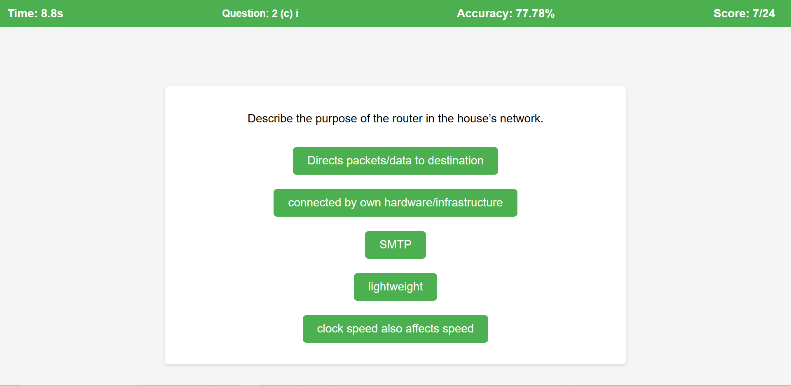

# Computing Quiz

Welcome to the Computing Quiz! This web application is designed to help you practice past paper questions related to various computing concepts. It provides an interactive quiz environment where you can test your knowledge and improve your understanding of the subject.

## Functionality

- The quiz presents you with a series of questions retrieved from a JSON file containing past paper questions.
- Questions are displayed one by one, with the answers shuffled for each question.
- You need to select the correct answer among the provided options.
- If you select the correct answer, it will be highlighted in green.
- If you select the wrong answer, you have one more chance to try before moving on.
- At the end of the quiz, your total score, accuracy, and time taken are displayed.
- The quiz app is designed with a responsive layout, making it suitable for various screen sizes.

## How to Use

1. Open the [Github Pages](https://najmajmal.github.io/computing-quiz/)

2. Start the quiz by clicking the "Begin" button.

3. Read each question carefully and select the correct answer from the options provided.

4. After completing the quiz, your score, accuracy, and time taken will be displayed.

5. Feel free to explore more questions by refreshing the page or restarting the quiz.

## Contributing

If you find any issues or would like to contribute to the Computing Quiz project, feel free to submit a pull request or open an issue.

## License

This project is licensed under the [MIT License](LICENSE).

---
Made with ❤️ by Najm Ajmal
